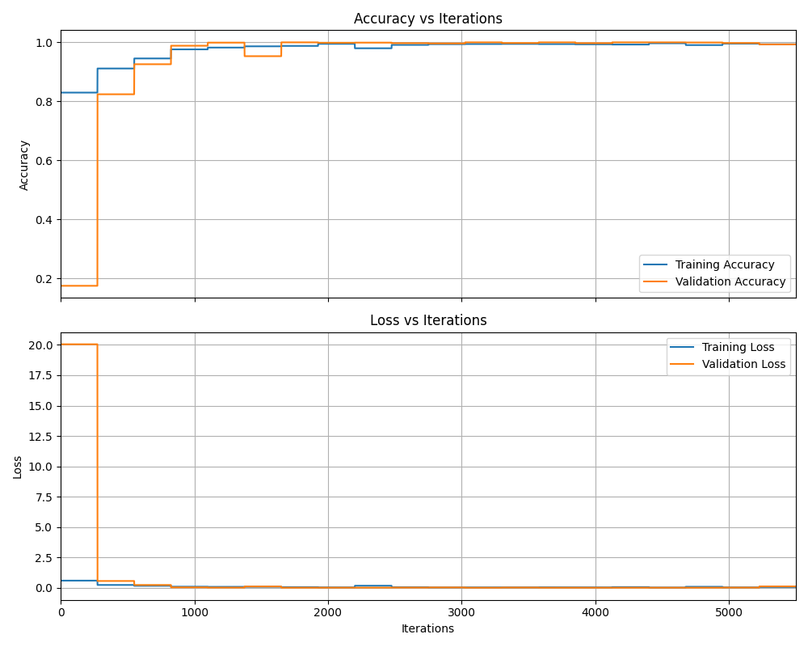

# TinyML Modulation Classifier

This project demonstrates a simple pipeline for generating various modulation signals like QPSK, 64QAM, PAM4 etc, training a lightweight neural network to classify them, converting the model to TensorFlow Lite format for edge deployment, and running inference using the TFLite interpreter. In total, 11 types of modulation signals with 1000 samples each with length 1024 were used for training.

## Motivation

In embedded applications such as telecommunications, IoT, and edge computing, lightweight AI models are essential due to limited hardware resources. This project demonstrates the use of TensorFlow Lite Interpreter to deploy compact, efficient signal classification models suitable for such environments.

## Project Structure

```
├── src/  
│   ├── generate_data.py         # Create different modulation signals  
│   ├── train_model.py           # Train a small model (Keras)  
│   ├── convert_tflite.py        # Convert to TFLite + quantize  
│   ├── run_inference.py         # Simulate edge inference on PC  
│   ├── confusion_matrix.py      # Plot confusion matrix for all classes
│  
├── README.md                    # Project description and instructions  
├── requirements.txt             # Python dependencies  
└── model/                       # Stores trained and converted models  
```

## Features

- Synthetic data generation for multiple signal modulation types
- Compact CNN architecture tailored for small datasets and embedded inference
- TensorFlow Lite conversion with quantization for efficient edge execution
- Example of signal classification inference using TFLite Interpreter in Python

## Getting Started

### Clone the repository:
```bash
git clone https://github.com/bhavanithya21/tinyml-modulation-classifier.git
cd tinyml-modulation-classifier
```
### Install dependencies:
```bash
pip install -r requirements.txt
```
### Generate data and train the model:
```bash
python src/generate_data.py
python src/train_model.py
```
> Note: Running these scripts will create the data/ and model/ folders automatically in the project directory.

### Convert model to TensorFlow Lite format:
```bash
python src/convert_tflite.py
```
### Run inference with the TFLite model:
```bash
python src/run_inference.py
```
### Plot the confusion matrix for the model:
```bash
python src/confusion_matrix.py
```
## Requirements

This project uses Python 3.11.9 and requires the following libraries:

- `numpy` – for numerical operations and signal generation
- `matplotlib` – for visualizing synthetic signals
- `scikit-learn` – for dataset splitting
- `scipy` – for signal generation
- `tensorflow` – for building, training, and converting the model using TensorFlow Lite
> TensorFlow Lite functionality (conversion and inference) is included within the main `tensorflow` package.

You can install all dependencies using:

```bash
pip install -r requirements.txt
```

## Model Results

This section provides plots to analyze the performance of the model trained with the generated modulated signals. In total, 11 types of modulation signals with 1000 samples each with length 1024 are used for training.




## Future Work

- Extend to additional signal types with noise and real RF datasets
- Implement FPGA/embedded hardware deployment examples
- Explore advanced AI models and pruning for better edge performance

## License

This project is licensed under the MIT License.
